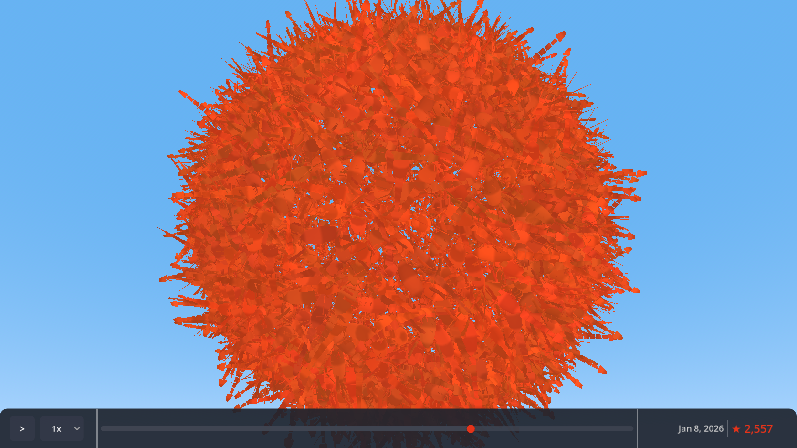

# Moltbot Star Tracker

A visual celebration of [moltbot](https://github.com/moltbot/moltbot)'s GitHub star history - watch 80,000+ 3D lobsters swarm through time.


<!-- Add a screenshot or GIF of the visualization here -->

## What is this?

A real-time visualization that animates moltbot's journey from its first GitHub star to over 80,000. Each star becomes a 3D lobster (matching moltbot's molting/lobster theme), forming an ever-growing swarm that you can orbit around and explore.

## Try It

Clone and run in Godot - see [Building](#building-from-source) below.

## Features

- **80,000+ 3D lobsters** - Each star represented as a procedural lobster model
- **Timeline playback** - Watch the swarm grow from day one, with adjustable speed (0.5x - 10x)
- **Interactive camera** - Orbit and zoom to explore the swarm from any angle
- **Touch support** - Pinch-zoom and drag-to-orbit on touch devices
- **Auto-zoom** - Camera automatically adjusts to keep the growing swarm in view

## Controls

| Action | Desktop | Touch |
|--------|---------|-------|
| Orbit camera | Click + drag | One-finger drag |
| Zoom | Scroll wheel | Pinch |
| Play/Pause | Click button | Tap button |
| Scrub timeline | Drag slider | Drag slider |
| Change speed | Click dropdown | Tap dropdown |

## Building from Source

### Requirements

- [Godot 4.6](https://godotengine.org/download) or later
- Git

### Steps

```bash
git clone https://github.com/blugart-dev/moltbot-star-tracker.git
cd moltbot-star-tracker
```

Open the project in Godot and press F5 to run.

## Technical Highlights

- **MultiMesh rendering** - GPU-instanced drawing handles 80K+ objects at 60fps
- **Procedural models** - Lobsters generated at runtime (~340 triangles each)
- **Fibonacci sphere** - Stars distributed evenly using golden angle algorithm

## License

[MIT](LICENSE)

## Credits

- [moltbot](https://github.com/moltbot/moltbot) - The AI assistant whose stars we're celebrating
- Built with [Godot Engine](https://godotengine.org)
